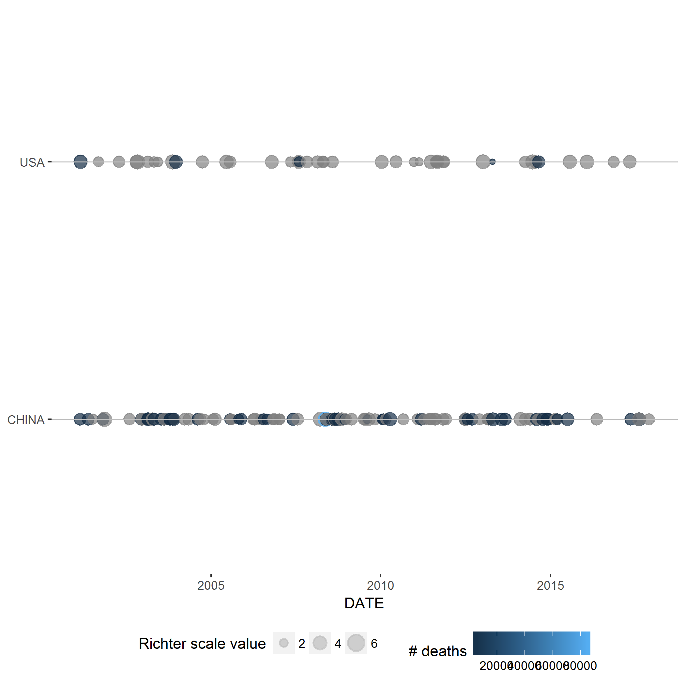
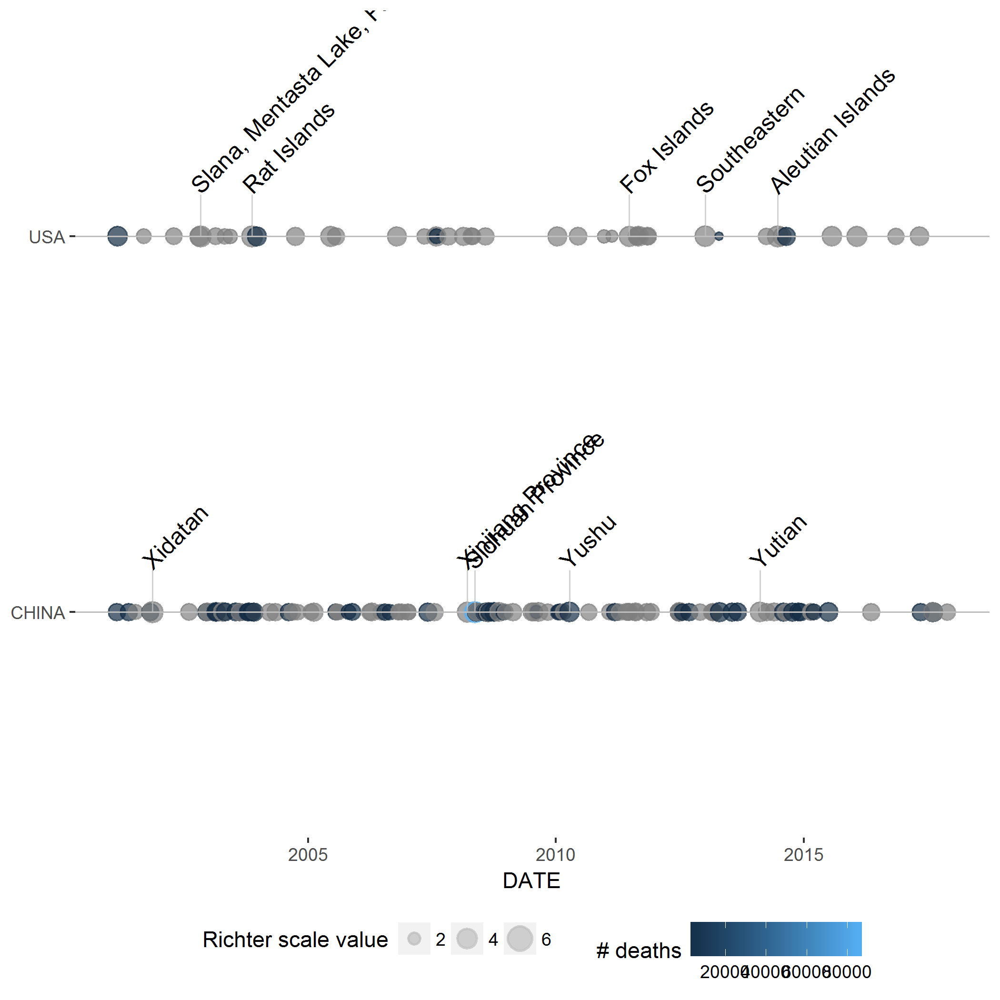
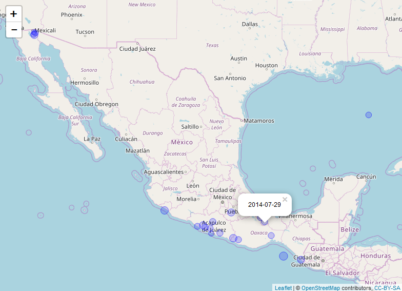
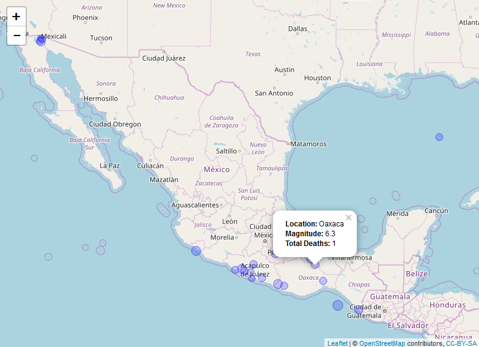

[](https://travis-ci.org/simongarisch/R-Capstone-NOAA)

# R Capstone: Cleaning and plotting NOAA earthquake data

## Objective
As part of the Coursera's R Capstone course this project contains functionality
to clean and plot raw NOAA earthquake data.

## Gathering the cleaned data
The raw earthquake data downloaded from NOAA is contained within the 'data_raw' folder.
This raw data can be loaded into a dataframe with the load_data() function:

```
df_raw <- load_data()
```

After we have this raw data the process of cleaning it is completed with eq_clean_data():
```
eq_clean_data <- function(df_raw){
  df <- df_raw
  df <- df %>% dplyr::filter(YEAR >= 0) %>%
    dplyr::mutate(date = get_date(DAY, MONTH, YEAR)) %>%
    dplyr::mutate(LATITUDE = as.numeric(LATITUDE), LONGITUDE = as.numeric(LONGITUDE)) %>%
    eq_location_clean()
  return(df)
}
```
Notice that this completes a few tasks:

1. Takes the raw data and removes all years < 0. Using as.Date is problematic with negative years.
1. Uses the get_date() function to create a column called 'date' which is of the class Date.
1. Converts both the latitude and longitude columns to numeric
1. Uses the eq_location_clean() function to create a column called CLEAN_LOCATION_NAME which both 
strips out the country name (including the colon) and converts names to title case.

We can apply this data loading and cleaning simply with:
```
# Load and clean the data
df_earthquakes <- load_data() %>% eq_clean_data()
```

## The use of earthquake timeline Geoms
There are two geoms, the first of which (geom_timeline) looks to chart a timeline of earthquakes for a given country / countries
with points (in the example) representing earthquake events, point size indicating
earthquake magnitude and colour representing number of deaths. x (the date) is a
required aesthetic whereas y (country) is optional. As an example:

```
df <- df_earthquakes %>% filter(COUNTRY %in% c("CHINA", "USA"), YEAR > 2000)
ggplot(df, aes(x = date, y = COUNTRY,
               color = as.numeric(TOTAL_DEATHS),
               size = as.numeric(EQ_PRIMARY),
               label = CLEAN_LOCATION_NAME)) +
      geom_timeline() +
      labs(size = "Richter scale value", color = "# deaths") +
      theme(panel.background = element_blank(),
            legend.position = "bottom",
            axis.title.y = element_blank()) +
      xlab("DATE")
```

Which will produce the chart:



The second geom, called geom_timeline_label, looks to build on geom_timeline by adding
labeled annotations. Vertical lines and location labels will be added to the top
n_max (default = 5) earthquakes by magnitude.

```
df <- df_earthquakes %>% filter(COUNTRY %in% c("CHINA", "USA"), YEAR > 2000)
ggplot(df, aes(x = date, y = COUNTRY,
               color = as.numeric(TOTAL_DEATHS),
               size = as.numeric(EQ_PRIMARY),
               label = CLEAN_LOCATION_NAME)) +
       geom_timeline() +
       labs(size = "Richter scale value", color = "# deaths") +
       theme(panel.background = element_blank(),
             legend.position = "bottom",
             axis.title.y = element_blank()) + xlab("DATE") +
       geom_timeline_label(data=df)
```

Here is the resulting chart:



There are also functions available to create and save these plots.
The two geom examples above were created using the functions plot_earthquakes_timeline()
and plot_earthquakes_timeline_label() which require as arguments a dataframe (df) and a boolean variable
(save_png) indicating whether to save the result as a png file.
```
df <- df_earthquakes %>% filter(COUNTRY %in% c("CHINA", "USA"), YEAR > 2000)
plot_earthquakes_timeline(df, save_png=TRUE)
plot_earthquakes_timeline_label(df, save_png=TRUE)
```

## Mapping earthquake events with leaflet
The mapping functions require the leaflet package to run and will chart
a subset of earthquake events on a map. In the example we take
earthquakes in Mexico for years >= 2000. The eq_map() function requires a
dataframe and annot_col (short for annotation column) as input. This function
then returns a leflet map that can be printed to the viewer in RStudio.
Here we annotate the earthquakes by date:
```
map1 <-load_data() %>%
        eq_clean_data() %>%
        dplyr::filter(COUNTRY == "MEXICO" & lubridate::year(date) >= 2000) %>%
        eq_map(annot_col = "date")
print(map1)
```
Which produces the output:


The eq_create_label() function returns a vector of html formatted names with details
including location, magnitude and deaths. We can use this to create a new column
and pass this to our eq_map() function as the annot_col argument.
```
map2 <-load_data() %>%
        eq_clean_data() %>%
        dplyr::filter(COUNTRY == "MEXICO" & lubridate::year(date) >= 2000) %>%
        dplyr::mutate(popup_text = eq_create_label(.)) %>%
        eq_map(annot_col = "popup_text")
print(map2)
```

